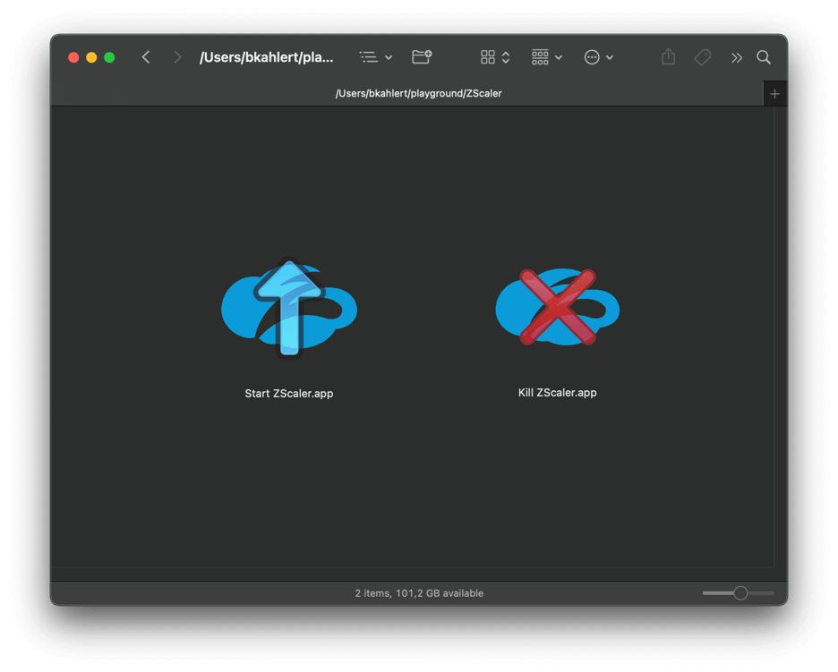

# Killing Zscaler on macOS

Zscaler can be annoying if you're trying to stop it. Despite have administrative rights, usually it asks for a password.

Pick one of the following options to take back control.

## Using the App

People who prefer apps over command lines can use
`Kill Zscaler.app` which is a simple wrapper of the shell script described below.

- [Download this repository as an archive](https://github.com/bkahlert/kill-zscaler/archive/refs/heads/main.zip).
- Open `Kill Zscaler.app` to kill Zscaler.
- To use Zscaler again, reboot or open `Start Zscaler.app`.



## Using a Shell Script

- Open Terminal or whatever terminal you prefer (e.g. [iTerm2](https://iterm2.com/)).
- Type `git clone https://github.com/bkahlert/kill-zscaler.git`
- Type `cd kill-zscaler` to change into the newly cloned repository.
- Make sure the scripts are executable by running `chmod +x kill-zscaler.sh start-zscaler.sh`
- Type `./kill-zscaler.sh` to kill Zscaler.
- To use Zscaler again, reboot or type `./start-zscaler.sh`.

## Using a Shell

- Open Terminal or whatever terminal you prefer (e.g. [iTerm2](https://iterm2.com/)).
- Type `find /Library/LaunchAgents -name '*zscaler*' -exec launchctl unload {} \;;sudo find /Library/LaunchDaemons -name '*zscaler*' -exec launchctl unload {} \;`
to kill Zscaler.
- To use Zscaler again, reboot or
  type `open -a /Applications/Zscaler/Zscaler.app --hide; sudo find /Library/LaunchDaemons -name '*zscaler*' -exec launchctl load {} \;`.

### Using an Alias

To kill Zscaler by typing `kill-zscaler` (and to start it with `start-zscaler`) do the following steps:

- Open the shell initialization file of your shell
  - Bash: ~/.bashrc
  - ZSH: ~/.zshrc
  - For more information aliases, read https://medium.com/@rajsek/zsh-bash-startup-files-loading-order-bashrc-zshrc-etc-e30045652f2e or any other appropriate Google
    match.
- Add the contents of `kill-zscaler.alias.txt` or the following lines to it:
  ```shell
  alias start-zscaler="open -a /Applications/Zscaler/Zscaler.app --hide; sudo find /Library/LaunchDaemons -name '*zscaler*' -exec launchctl load {} \;"
  alias kill-zscaler="find /Library/LaunchAgents -name '*zscaler*' -exec launchctl unload {} \;;sudo find /Library/LaunchDaemons -name '*zscaler*' -exec launchctl unload {} \;"
  ```
- Open a new shell (or type `source [shell initialization file]` to load your changes)
- Type `kill-zscaler` to kill Zscaler
- To use Zscaler again, reboot or type `start-zscaler`.
